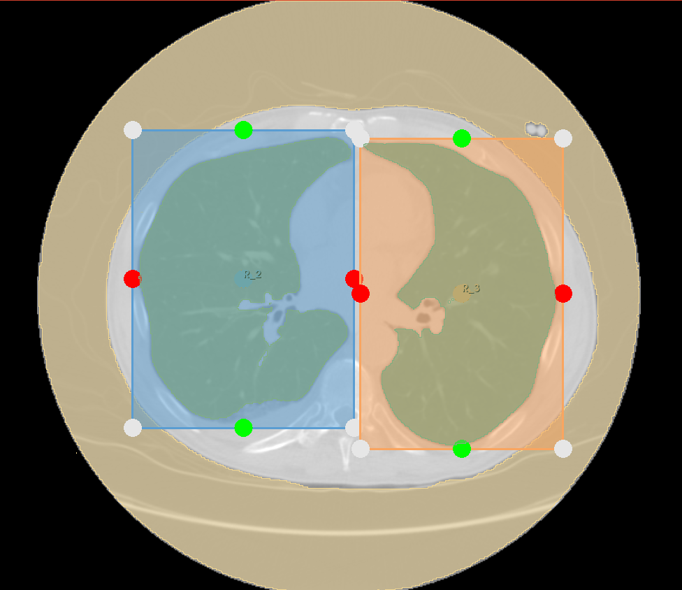
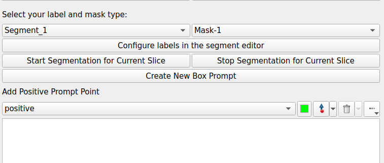
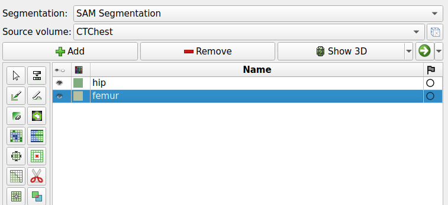
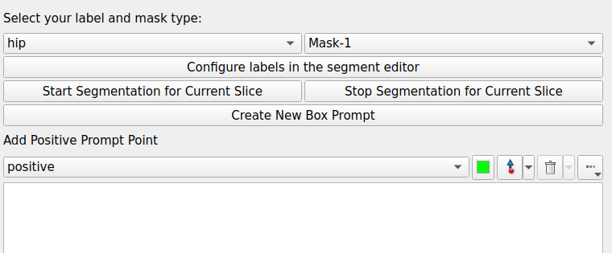
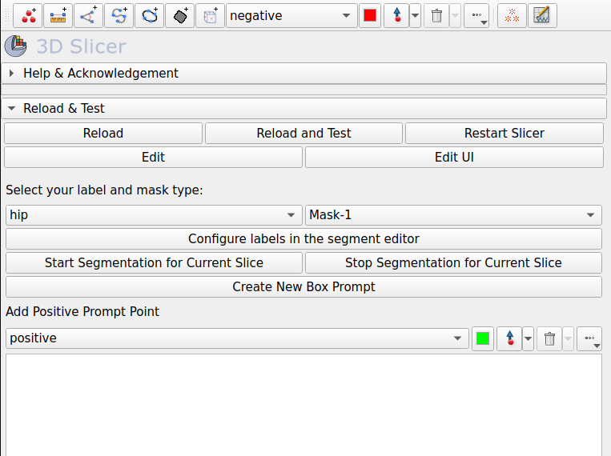

# SlicerSegmentWithSAM

SegmentWithSAM aims to asist its users in segmenting medical data on <a href="https://github.com/Slicer/Slicer">3D Slicer</a> by comprehensively integrating the <a href="https://github.com/facebookresearch/segment-anything">Segment Anything Model (SAM)</a> developed by Meta.



## Installation via Extension Manager

To install this extension via 3D Slicer's Extension Manager, you should need to follow the steps below:

- Go to Extension Manager of 3D Slicer (Ctrl+4)
- Search for "SegmentWithSAM"
- Click "Install" button
- Restart 3D Slicer

## Installation via GitHub Repository

You can clone this repository by running the following command:

```
git clone https://github.com/mazurowski-lab/SlicerSegmentWithSAM.git
```

Before adding this extension to 3D Slicer, you must install some dependencies in 3D Slicer. To do this, you need the run the following commands in 3D Slicer's Python terminal.

```
slicer.util.pip_install("git+https://github.com/facebookresearch/segment-anything.git") 
slicer.util.pip_install("torch torchvision torchaudio") 
slicer.util.pip_install("opencv-python") 
```

You should also download the <a href="https://dl.fbaipublicfiles.com/segment_anything/sam_vit_h_4b8939.pth">following checkpoint</a> of SAM into the repository directory (in the same directory as the readme file).

After downloading all necessary files, you need to introduce the extension to 3D Slicer. Please go to Modules > Developer Tools > Extension Wizard on 3D Slicer and click 'Select Extension' button. You should select the root folder that contains this repository in the pop-up. If you don't get any error on Python terminal, that means you are ready to use the extension!

## Usage

You can watch our <a href="https://youtu.be/PAW2iIXMGvY">tutorial video</a> to learn how to use SegmentWithSAM.

First of all, make sure you open a file on 3D Slicer before you start using SegmentWithSAM.

If you've added the extension to 3D Slicer, you should be able to see it under **Modules > Segmentation > SegmentWithSAM**. You can see the user interface of the extension after you click on SegmentWithSAM in this menu.

Before starting the segmentation, make sure that you've created the necessary labels for your case by clicking "Configure labels in the segment editor" button. You need to turn back to our extension through Modules > Segmentation > SegmentWithSAM path again, after you create your labels in the segment editor. You are ready to segment now!

 

Firstly, select the label you want to segment from the dropdown list (hip for the image below). Then, click "Start Segmentation for Current Slice" button. 



If it is the first to segment a slice of this file, you need to wait for SAM to produce some files that will be used for the segmentation. After SAM generated these files, you can start putting **prompt points** or **prompt boxes** on the current slice. You'll be able to see the segmentation mask on 3D Slicer. Please click "Stop Segmentation for Current Slice" whenever you finish your segmentation for the current slice. 



If you are not satisfied with the segmentation mask produced by SAM, you can edit it as you wish using the "Segment Editor" module of 3D Slicer.
